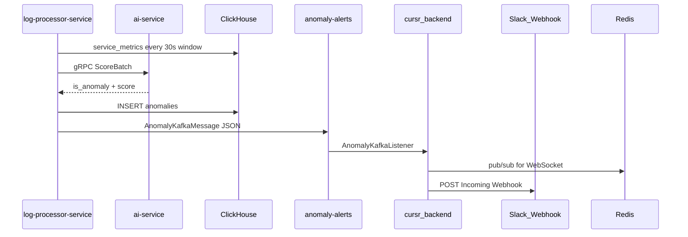

# Causr / Cursr Observability Platform — Project Guide

This document is the full project reference: architecture, services, data model, APIs, local development, and the work completed in this repository to date.

For a shorter quick-start, see [README.md](README.md).

---

## Table of contents

1. [What this project is](#what-this-project-is)
2. [Architecture](#architecture)
3. [Repository layout](#repository-layout)
4. [Infrastructure (Docker)](#infrastructure-docker)
5. [Applications](#applications)
6. [ClickHouse data model](#clickhouse-data-model)
7. [API reference](#api-reference)
8. [Dashboard UIs](#dashboard-uis)
9. [Local development workflow](#local-development-workflow)
10. [Work completed in this repo](#work-completed-in-this-repo)
11. [Troubleshooting](#troubleshooting)
12. [Testing](#testing)

---

## What this project is

**Causr** (also referred to as **Cursr** in some service names) is an observability and incident-intelligence platform built as a monorepo. It ingests OpenTelemetry (OTLP) logs and traces, stores them in ClickHouse, detects anomalies, and exposes dashboard APIs for operators and developers.

### Core capabilities

| Capability | Description |
|------------|-------------|
| **Telemetry ingest** | OTLP logs/traces via OpenTelemetry Collector → Kafka → Spring Boot processor |
| **Log storage** | Hot/cold tiering in ClickHouse (`logs_hot`, `logs_cold`) with TTL |
| **Sampling** | HOT path favors errors, high latency, and anomaly signals |
| **Clustering** | Materialized view rolls up logs into `log_clusters` by service + issue type |
| **Anomaly detection** | Windowed service metrics + AI scoring → `anomalies` table + Kafka alerts |
| **Dashboard BFF** | `cursr_backend` aggregates KPIs, caches in Redis, serves REST + WebSocket |
| **Developer UI** | `causr-dashboard` — Vite/React app with Dashboard, Logs, and Anomalies pages |

### Synthetic workload

`log-sender-backend` simulates a microservices mesh (`api-gateway`, `auth-service`, `payment-service`, etc.) emitting OTLP logs with realistic attributes: `issue.type`, `http.status_code`, `app.latency_ms`, trace/span IDs, and per-log `service.name`.

---

## Architecture

```
┌─────────────────────┐
│  log-sender-backend │  Synthetic OTLP producer (port 8082)
│  (Spring Boot)      │  Resource: service.name = log-sender-backend
└──────────┬──────────┘  Log attrs: service.name = payment-service, etc.
           │ OTLP HTTP :4318
           ▼
┌─────────────────────┐
│  OTel Collector     │  Receives OTLP, batches, exports protobuf to Kafka
│  :4317 gRPC         │
│  :4318 HTTP         │
└──────────┬──────────┘
           │ logs.raw, traces.raw
           ▼
┌─────────────────────┐
│  Kafka + Zookeeper  │  Host apps: localhost:29092
└──────────┬──────────┘
           │
           ▼
┌─────────────────────┐
│ log-processor-      │  Consumes Kafka, maps OTLP → RawLogEvent,
│ service (:8080)     │  samples, writes ClickHouse, streams metrics,
│                     │  publishes anomaly-alerts
└──────────┬──────────┘
           │
     ┌─────┼─────────────────┐
     ▼     ▼                 ▼
 ClickHouse  Redis      anomaly-alerts
 (8123)      (6379)      (Kafka topic)
     │                       │
     ▼                       ▼
┌─────────────────────┐  cursr_backend consumes alerts,
│  cursr_backend      │  refreshes Redis cache, queries CH
│  (:8090)            │
└──────────┬──────────┘
           │ REST / WebSocket
           ▼
┌─────────────────────┐
│  causr-dashboard    │  Vite + React 19 (:5173)
│  observability-     │  Next.js dev UI (:3000) — optional
│  dashboard          │
└─────────────────────┘
```

### Data flow summary

1. **Emit** — `log-sender-backend` sends OTLP logs to the collector.
2. **Buffer** — Collector writes protobuf `LogsData` to Kafka topic `logs.raw`.
3. **Process** — `log-processor-service` maps OTLP records, applies HOT sampling, inserts into `observability.logs_hot`.
4. **Roll up** — ClickHouse MV `log_clusters_mv` aggregates clusters on insert.
5. **Score** — Kafka Streams + optional AI service produce `service_metrics` and `anomalies`.
6. **Serve** — `cursr_backend` reads ClickHouse (and Redis cache) for `/api/dashboard/*`.
7. **Display** — `causr-dashboard` calls BFF for summary/anomalies and processor for raw logs.

---

## Repository layout

| Directory | Technology | Port | Role |
|-----------|------------|------|------|
| `log-sender-backend/` | Spring Boot 3, Java 21 | 8082 | Synthetic OTLP log producer |
| `log-processor-service/` | Spring Boot 3, Java 17+, Kafka Streams | 8080 | Ingest, sampling, ClickHouse writer, anomaly pipeline |
| `cursr_backend/` | Spring Boot 3, Java 21 | 8090 | Dashboard BFF (REST + WebSocket + Redis cache) |
| `causr-dashboard/` | Vite, React 19, TypeScript | 5173 | Developer dashboard UI (recommended) |
| `observability-dashboard/` | Next.js | 3000 | Alternate dev UI |
| `cursr_landing/` | Vite | 5173 | Marketing landing page |
| `infra/` | Docker configs | — | ClickHouse init SQL, Kafka topics, OTel collector |
| `docker-compose.yml` | Docker Compose | — | Root infrastructure stack |

---

## Infrastructure (Docker)

Start the full stack from the repo root:

```bash
docker compose up -d
```

### Services

| Container | Image | Host ports | Purpose |
|-----------|-------|------------|---------|
| `zookeeper` | confluentinc/cp-zookeeper:7.6.1 | 2181 | Kafka coordination |
| `kafka` | confluentinc/cp-kafka:7.6.1 | 9092, **29092** | Message bus (JVM apps use 29092) |
| `kafka-init` | (one-shot) | — | Creates topics |
| `redis` | redis:7-alpine | 6379 | Dashboard cache + pub/sub |
| `clickhouse` | clickhouse-server:24.3 | 8123, 9000 | Analytics store |
| `clickhouse-init` | (one-shot) | — | Applies `infra/clickhouse/init.sql` |
| `ai-service` | built from `log-processor-service/ai_service` | 8000, **50051** | Drain3 HTTP + IsolationForest gRPC scorer |
| `otel-collector` | otel-collector-contrib:0.96.0 | 4317, 4318 | OTLP → Kafka |

### Kafka topics

| Topic | Partitions | Content |
|-------|------------|---------|
| `logs.raw` | 3 | OTLP Logs protobuf |
| `traces.raw` | 3 | OTLP Traces protobuf |
| `anomaly-alerts` | 1 | Anomaly events from processor |
| `logs.anomalies` | 1 | Legacy compatibility topic |

Created by `infra/kafka/create-topics.sh`.

### Default connection strings (Spring apps)

| Service | Default endpoint |
|---------|------------------|
| Kafka | `localhost:29092` |
| Redis | `localhost:6379` |
| ClickHouse HTTP/JDBC | `localhost:8123/observability` |
| OTel Collector | `localhost:4318` (HTTP), `localhost:4317` (gRPC) |
| AI scorer | `localhost:50051` (gRPC), `localhost:8000` (HTTP) |

See [`.env.example`](.env.example) for optional overrides.

### Verify infrastructure

```bash
curl http://localhost:8123/ping
docker exec kafka kafka-topics --bootstrap-server localhost:9092 --list
curl 'http://localhost:8123/?query=SHOW+TABLES+FROM+observability'
curl -s -o /dev/null -w "%{http_code}" http://localhost:4318/v1/logs   # 404/405 = running
```

---

## Applications

### log-sender-backend

**Purpose:** Generate realistic synthetic telemetry for local development and demos.

- Emits 6 logs per scheduler tick (configurable) across simulated microservices.
- Sets **resource-level** `service.name=log-sender-backend` and **log-record** `service.name` to the simulated service (e.g. `inventory-service`).
- Attributes include: `deployment.environment`, `issue.type`, `http.status_code`, `app.latency_ms`, trace/span IDs, operation names.

```bash
cd log-sender-backend && mvn spring-boot:run
```

Key config (`application.yml`):

- `otel.exporter.otlp.endpoint` — default `http://localhost:4318`
- `app.log-loop.enabled`, `app.log-loop.fixed-delay-ms`, `app.log-loop.logs-per-tick`

---

### log-processor-service

**Purpose:** Core ingest and processing pipeline.

**Responsibilities:**

- Consume `logs.raw` Kafka topic (OTLP protobuf).
- Map OTLP → `RawLogEvent` via `OtlpLogsMapper`.
- HOT sampling (errors, 5xx, slow logs, anomaly signals).
- Insert into `logs_hot` / `logs_cold`.
- Kafka Streams for per-service windowed metrics.
- Optional gRPC AI anomaly scorer.
- REST API for recent logs, search, clusters.

```bash
cd log-processor-service && mvn spring-boot:run
```

**Key classes:**

| Class | Role |
|-------|------|
| `OtlpLogsMapper` | OTLP log record → `RawLogEvent` |
| `OtlpLogAttributeSupport` | Duration keys, HTTP status normalization |
| `ObservabilityApiController` | `/api/logs/recent`, `/api/clusters`, `/api/anomalies` |
| `CorsConfig` | CORS for `http://localhost:*` on `/api/**` |

> **Note:** `log-processor-service/docker-compose.yml` starts only Zookeeper + Kafka. Use the **root** `docker-compose.yml` for the full stack.

---

### cursr_backend

**Purpose:** Production dashboard Backend-for-Frontend (BFF).

**Responsibilities:**

- Query ClickHouse via `DashboardSql` + `DashboardQueryService`.
- Cache dashboard slices in Redis (`DashboardCacheRefreshJob`).
- JDBC fallback when Redis cache is cold (`cachedListOrQuery`).
- Compose KPIs, service health, top errors, clusters into `/api/dashboard/summary`.
- WebSocket for live updates.
- Consume `anomaly-alerts` from Kafka.

```bash
cd cursr_backend && mvn spring-boot:run
```

Default port: **8090**.

---

### causr-dashboard

**Purpose:** Dense, dark-themed developer UI.

| Route | Page | Backend |
|-------|------|---------|
| `/` | Dashboard (KPIs, service health, top errors, clusters) | `cursr_backend` :8090 |
| `/logs` | Recent logs + search | `log-processor-service` :8080 |
| `/anomalies` | Anomaly list | `cursr_backend` :8090 |

```bash
cd causr-dashboard
cp .env.example .env    # optional
npm install
npm run dev
```

Open [http://localhost:5173](http://localhost:5173).

Environment:

- `VITE_BFF_API_BASE` — default `http://localhost:8090`
- `VITE_PROCESSOR_API_BASE` — default `http://localhost:8080`

---

## ClickHouse data model

Database: `observability`

| Table | Engine | Purpose |
|-------|--------|---------|
| `logs_hot` | MergeTree, 30d TTL | Primary query table for recent logs |
| `logs_cold` | MergeTree, 90d TTL | Longer retention for sampled-out logs |
| `spans` | MergeTree, 30d TTL | Trace spans |
| `log_clusters` | SummingMergeTree | Error/issue rollups by tenant + service + cluster |
| `log_clusters_mv` | Materialized View | Populates `log_clusters` from `logs_hot` inserts |
| `service_metrics` | MergeTree | Windowed per-service KPIs for AI scoring |
| `anomalies` | MergeTree | Detected anomalies with RCA fields |

### `logs_hot` columns

`timestamp`, `tenant_id`, `service_name`, `log_level`, `message`, `trace_id`, `span_id`, `duration_ms`, `anomaly_score`, `cluster_id`, `attributes` (Map)

### Cluster rollup logic (`log_clusters_mv`)

Clusters are keyed by:

1. Explicit `cluster_id` on the log (e.g. Drain3), else
2. `attributes['issue.type']` (stable for synthetic workload), else
3. `cityHash64(message)` fallback

Aggregated with `sum(event_count)` grouped by `(tenant_id, service_name, cluster_id)`.

Schema sources:

- `infra/clickhouse/init.sql` — Docker init (database `observability`)
- `log-processor-service/src/main/resources/db/clickhouse/schema.sql` — processor-local schema (no `observability.` prefix)

---

## API reference

### cursr_backend — Dashboard BFF (`:8090`)

| Method | Path | Description |
|--------|------|-------------|
| GET | `/api/health` | Health check |
| GET | `/api/dashboard/summary` | Full dashboard payload (KPIs, health, errors, clusters, anomalies) |
| GET | `/api/dashboard/kpis` | KPI strip only |
| GET | `/api/dashboard/error-rate` | Per-service error rate (5m) |
| GET | `/api/dashboard/p95-latency` | Per-service P95 latency (5m) |
| GET | `/api/dashboard/top-errors` | Top error messages with trend (30m vs prior 30m) |
| GET | `/api/dashboard/service-metrics-recent` | Recent windowed metrics per service |
| GET | `/api/dashboard/error-clusters` | Top error clusters |
| GET | `/api/dashboard/failure-risk` | Pre-failure risk scores |
| GET | `/api/dashboard/logs` | Log drill-down (service + message filter) |
| GET | `/api/dashboard/trace/{traceId}` | Trace logs + spans |
| GET | `/api/dashboard/anomalies/{id}` | Anomaly detail |
| GET | `/api/dashboard/anomalies/{id}/logs` | Logs for anomaly window |

### log-processor-service (`:8080`)

| Method | Path | Description |
|--------|------|-------------|
| GET | `/actuator/health` | Health |
| GET | `/actuator/prometheus` | Prometheus metrics |
| GET | `/api/logs/recent` | Recent HOT logs |
| GET | `/api/search?q=` | Message search |
| GET | `/api/clusters` | Raw cluster table rows |
| GET | `/api/anomalies` | Anomaly rows from processor |
| POST | `/api/dev/emit-anomaly` | Dev-only anomaly injection |

### Example: dashboard summary smoke test

```bash
curl -s http://localhost:8090/api/dashboard/summary | jq '.kpis, .serviceHealth[0:3], .topErrors[0:2], .errorClusters[0:2]'
```

Expected after healthy ingest:

- `serviceHealth` lists `api-gateway`, `auth-service`, `payment-service`, etc.
- `kpis.p99LatencyMs.value` > 0
- `topErrors` has grouped messages
- `errorClusters[].service_name` populated with `error_count` > 1 for repeated issue types

---

## Dashboard UIs

| UI | Stack | When to use |
|----|-------|-------------|
| **causr-dashboard** | Vite + React 19 | Recommended local dev UI; hybrid BFF + processor APIs |
| **observability-dashboard** | Next.js | Alternate/experimental dev UI |
| **cursr_landing** | Vite | Marketing site only |

---

## End-to-end anomaly detection + Slack

### Detection pipeline



| Layer | Component | Notes |
|-------|-----------|-------|
| Per-log EWMA | `EwmaScorer` | `anomaly_score` on `logs_hot`; affects HOT sampling |
| Window AI | `ServiceMetricsWindowHandler` + `ai-service` | 30s windows; IsolationForest (`is_anomaly` when score &lt; -0.4) |
| Storage | `observability.anomalies` | Dashboard Anomalies page + summary API |
| Alert bus | Kafka `anomaly-alerts` | Consumed by `cursr_backend` |
| Realtime UI | Redis → WebSocket `/topic/anomalies/{tenant}` | Optional; UI currently polls |
| Slack | `AnomalySlackNotifier` | Incoming Webhook; dedupe per service+env |

### Local dev requirements

1. `docker compose up -d` — includes **`ai-service`**
2. Log processor with **`SPRING_PROFILES_ACTIVE=dev`** — sets `bypass-history-gate: true` and enables `POST /api/dev/emit-anomaly` ([`application-dev.yml`](log-processor-service/src/main/resources/application-dev.yml))
3. Without dev profile, AI scoring waits for **7 days** of `service_metrics` history ([`ServiceMetricsHistoryChecker`](log-processor-service/src/main/java/com/example/logprocessor/streams/ServiceMetricsHistoryChecker.java))

### Slack configuration (`cursr_backend`)

| Property | Default | Description |
|----------|---------|-------------|
| `app.slack.enabled` | `false` | Master switch |
| `app.slack.webhook-url` | `${SLACK_WEBHOOK_URL}` | Incoming Webhook URL |
| `app.slack.dashboard-base-url` | `http://localhost:5173` | Link in Slack message |
| `app.slack.dedupe-window-minutes` | `5` | Suppress repeat alerts per tenant/service/env |

Create a webhook: Slack workspace → Apps → Incoming Webhooks. Never commit the URL; use `.env` or shell export.

```bash
export SLACK_WEBHOOK_URL=https://hooks.slack.com/services/...
cd cursr_backend && mvn spring-boot:run -Dapp.slack.enabled=true
```

### Smoke test

```bash
docker compose up -d
cd log-processor-service && SPRING_PROFILES_ACTIVE=dev mvn spring-boot:run
cd log-sender-backend && mvn spring-boot:run
export SLACK_WEBHOOK_URL=... && cd cursr_backend && mvn spring-boot:run -Dapp.slack.enabled=true

curl -X POST 'http://localhost:8080/api/dev/emit-anomaly?serviceName=payment-service&environment=staging'
curl -s http://localhost:8090/api/dashboard/summary | jq '.anomalies[0]'
```

RCA (`rca_text`) is **not** generated in this phase — dashboard shows `(no RCA yet)` until a future LLM worker is added.

---

## Local development workflow

### 1. Start infrastructure

```bash
docker compose up -d
```

Wait for healthy containers (`docker compose ps`).

### 2. Start applications (order matters)

```bash
# Terminal 1 — processor (must be up before logs accumulate)
cd log-processor-service && mvn spring-boot:run

# Terminal 2 — synthetic telemetry
cd log-sender-backend && mvn spring-boot:run

# Terminal 3 — dashboard BFF
cd cursr_backend && mvn spring-boot:run

# Terminal 4 — UI (optional)
cd causr-dashboard && npm run dev
```

### 3. Wait ~1–2 minutes, then verify

```bash
curl http://localhost:8080/api/logs/recent
curl http://localhost:8090/api/dashboard/summary
```

### 4. Stop

```bash
docker compose down          # keep ClickHouse data
docker compose down -v       # wipe volumes (needed after schema changes)
```

---

## Work completed in this repo

This section documents the engineering work done during development of this monorepo.

### 1. Root Docker infrastructure

- Added [`docker-compose.yml`](docker-compose.yml) at repo root: Zookeeper, Kafka, Redis, ClickHouse, OTel Collector, one-shot init jobs.
- [`infra/kafka/create-topics.sh`](infra/kafka/create-topics.sh) — `logs.raw` (3p), `traces.raw` (3p), `anomaly-alerts`, `logs.anomalies`.
- [`infra/clickhouse/init.sql`](infra/clickhouse/init.sql) — full `observability` schema.
- [`infra/otel-collector/config.yaml`](infra/otel-collector/config.yaml) — OTLP → Kafka (`otlp_proto` encoding).
- [`infra/clickhouse/users.d/default-user.xml`](infra/clickhouse/users.d/default-user.xml) — empty password for ClickHouse 24.3 local dev.
- Aligned Spring `application.yml` files to `localhost:29092`, `6379`, `8123`, `4317`/`4318`.
- Root [`README.md`](README.md) and [`.env.example`](.env.example).

### 2. causr-dashboard (Vite + React)

Built [`causr-dashboard/`](causr-dashboard/) — developer UI with:

- **Dashboard** — summary from BFF (`/api/dashboard/summary`)
- **Logs** — recent logs from processor (`/api/logs/recent`)
- **Anomalies** — from BFF
- Dark dev-tool aesthetic, KPI strip, data tables, status badges
- Env-based API bases (`VITE_BFF_API_BASE`, `VITE_PROCESSOR_API_BASE`)

### 3. Runtime bug fixes

| Issue | Fix |
|-------|-----|
| Zookeeper healthcheck failing | Switched from `ruok` to `srvr` probe |
| OTel Collector Kafka export error | Flat `topic`/`encoding` format for collector v0.96.0 |
| `500` on `/api/dashboard/summary` | Fixed ClickHouse SQL alias shadowing in `SERVICE_METRICS_RECENT_PER_SERVICE`; qualified anomaly columns |
| `403` on `/api/logs/recent` | Added `CorsConfig` in log-processor (`/api/**`, `allowedOriginPatterns("http://localhost:*")`) |
| `TOP_ERROR_CLUSTERS` column mismatch | Mapped to `representative_message` / `event_count` |
| Kafka anomaly listener | `AnomalyKafkaListener` — topic `anomaly-alerts`, flexible `tenantId` parsing |

### 4. Dashboard data pipeline fix

The dashboard was returning misleading data: everything under `log-sender-backend`, `p99LatencyMs: 0`, empty `topErrors`, useless clusters, 100% error rate.

#### Root causes

| Symptom | Cause |
|---------|-------|
| Single `log-sender-backend` bucket | `OtlpLogsMapper` used **resource** `service.name`, ignoring **log-record** `service.name` |
| `p99LatencyMs: 0` | `app.latency_ms` not mapped to `duration_ms` |
| `environment: unknown` | `deployment.environment` read from resource only |
| `topErrors: []` | `DashboardQueryService` read Redis only — no ClickHouse fallback |
| Clusters `event_count: 1` | MV hashed full message bodies; no `service_name` column |
| `errorRate: 100%` | Side effect of single bucket + HOT sampling favoring errors |

#### Fixes applied

**Ingest (`log-processor-service`):**

- `OtlpLogsMapper` — log-record `service.name` and `deployment.environment` override resource values (`firstNonBlank`).
- `OtlpLogAttributeSupport` — added `app.latency_ms` to duration attribute keys.
- `OtlpLogsMapperTest` — tests for service override, latency, environment.

**BFF (`cursr_backend`):**

- `DashboardQueryService.cachedListOrQuery()` — JDBC fallback when Redis cache is empty for: error rate, latency, top errors, service health, clusters, service metrics, anomalies.
- `TOP_ERRORS_30M_WITH_TREND` — aligned error predicate with error-rate logic (`ERROR` OR HTTP ≥ 500).
- `TOP_ERROR_CLUSTERS` — selects `service_name`, uses `sum(event_count)` with `GROUP BY`.

**ClickHouse schema:**

- `log_clusters` — added `service_name` column.
- `log_clusters_mv` — subquery groups by stable `cluster_id` (`issue.type` when present); `count()` per batch.
- Migration documented in README (`docker compose down -v` or drop/recreate MV + table).

**Tests:**

- Updated `ClickHouseDashboardTestSupport` seed data for new cluster schema.
- `DashboardClickHouseSqlIntegrationTest` — `service_name` assertion on clusters.

#### Verified outcomes

| Metric | Before | After |
|--------|--------|-------|
| Service health | `log-sender-backend` only | Per-microservice names |
| P99 latency | 0 | ~1200 ms |
| Top errors | Empty | Populated (legacy rows age out of 30m window) |
| Error clusters | Empty `service_name`, count 1 | e.g. `api-gateway` / `dependency_timeout` count 16+ |

---

## Troubleshooting

### Port already in use

```bash
ss -tlnp | grep -E ':8080|:8090'
kill <pid>
```

Background agent starts may leave orphan JVMs; stop them before running `mvn spring-boot:run` in your terminal.

### ClickHouse schema out of date

After `log_clusters` changes:

```bash
docker compose down -v && docker compose up -d
```

Or manually:

```sql
DROP VIEW IF EXISTS observability.log_clusters_mv;
DROP TABLE IF EXISTS observability.log_clusters;
-- Re-apply cluster section from infra/clickhouse/init.sql
```

### Empty dashboard despite running sender

1. Confirm `docker compose ps` — all healthy.
2. Confirm `log-processor-service` is running on 8080 (consumes Kafka).
3. Check recent ingest:  
   `curl 'http://localhost:8123/?query=SELECT service_name, count() FROM observability.logs_hot WHERE timestamp >= now() - INTERVAL 2 MINUTE GROUP BY service_name'`
4. Confirm `cursr_backend` on 8090.

### CORS errors from dashboard

Ensure log-processor `CorsConfig` is active and you're accessing the UI from `http://localhost:5173`.

### Anomalies empty or no Slack message

| Symptom | Check |
|---------|--------|
| No `anomalies` rows | Is `ai-service` up? (`docker compose ps`) Processor on **dev** profile? gRPC logs at WARN in processor? |
| `emit-anomaly` returns 404 | `SPRING_PROFILES_ACTIVE=dev` (enables dev endpoints) |
| Dashboard empty but CH has rows | Anomalies query uses last **1 hour** window; check `created_at` |
| No Slack post | `app.slack.enabled=true` and `SLACK_WEBHOOK_URL` set; check BFF logs for dedupe/suppression |
| AI gRPC errors | `localhost:50051` reachable; restart `ai-service` container |

---

## Testing

```bash
# log-processor-service unit tests
cd log-processor-service && mvn test

# cursr_backend unit + MockMvc tests
cd cursr_backend && mvn test

# causr-dashboard build
cd causr-dashboard && npm run build
```

`DashboardClickHouseSqlIntegrationTest` in `cursr_backend` requires Docker with API 1.40+ (Testcontainers). Skipped automatically when Docker is unavailable.

---

## Related documentation

| Document | Content |
|----------|---------|
| [README.md](README.md) | Quick start |
| [log-processor-service/README.md](log-processor-service/README.md) | Processor setup |
| [log-processor-service/docs/LOG_PROCESSOR_SERVICE.md](log-processor-service/docs/LOG_PROCESSOR_SERVICE.md) | Deep processor docs |
| [cursr_backend/README.md](cursr_backend/README.md) | BFF API summary |
| [cursr_backend/docs/clickhouse/logs_schema.md](cursr_backend/docs/clickhouse/logs_schema.md) | Column layout |

---

## Out of scope / future work

- Full OAuth/SSO / org management SaaS
- Multi-region / HA ClickHouse-Kafka
- Replacing IsolationForest with a trained production model

Completed in the readiness plan: RCA (`llm-router-service`), live STOMP UI, traces page, API-key auth + tenant-scoped SQL, app Docker/compose profile, CI, instrumentation docs.

---

*Last updated: June 2026 — includes E2E anomaly detection, Slack alerts, and dashboard data pipeline fixes.*
